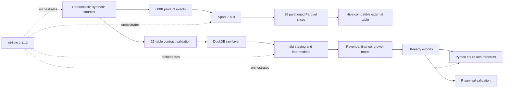
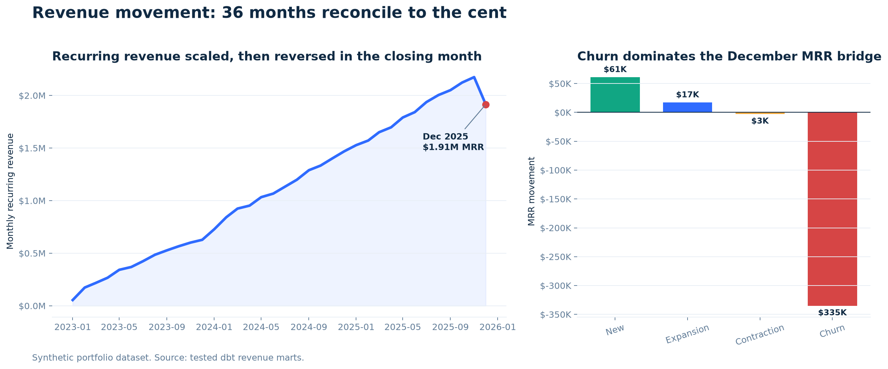
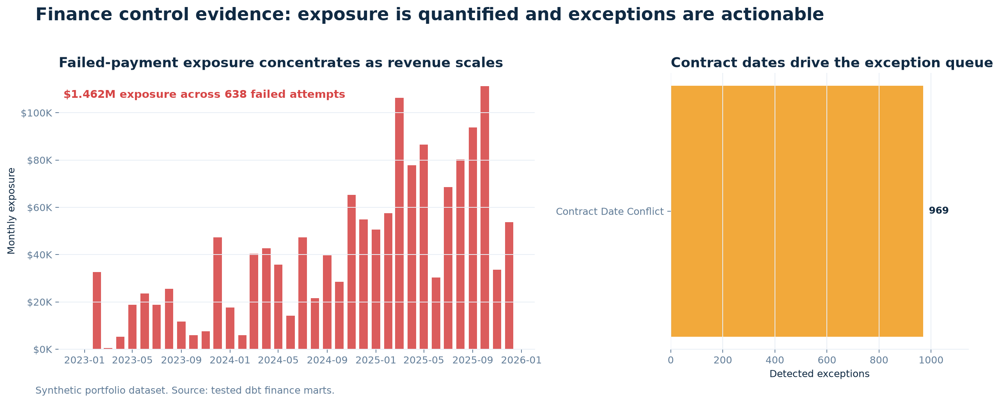
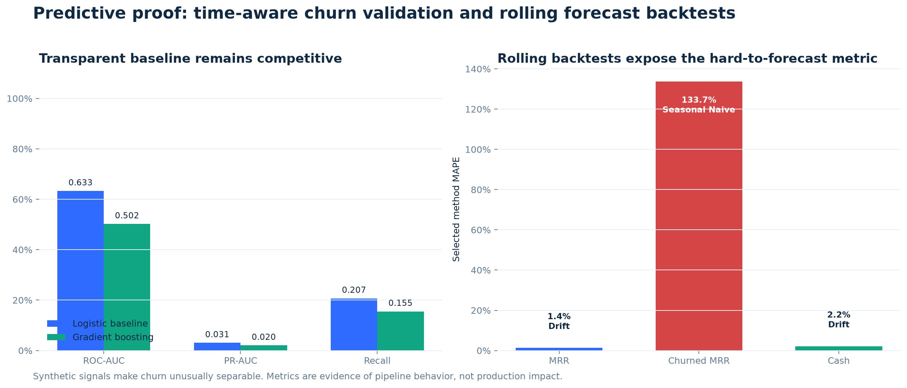

# Subscription Revenue and Customer Growth Intelligence Platform

> A tested B2B SaaS analytics platform that explains recurring-revenue movement, identifies billing leakage, prioritizes retention work, and gives Finance and Revenue Operations a reconciled metric layer.

This project models how a B2B SaaS analytics team would connect subscription activity, invoices, payments, product usage, support, marketing, customer health, and revenue recognition into one decision system. It is an analytics product, not a notebook collection.

> **Synthetic-data disclosure:** every record is generated with a fixed seed. Findings describe the project dataset only; no production impact is claimed.

## Architecture



## Executive snapshot

| Verified result | Evidence |
|---|---:|
| Source and modeling records | **693,805** |
| Product-usage events | **600,000** |
| Customer accounts | **1,200** |
| December 2025 MRR | **$1.915M** |
| December 2025 ARR | **$22.977M** |
| Maximum MRR bridge variance | **$0.00** |
| Failed-payment exposure | **$1.462M across 638 attempts** |
| Finance exceptions detected | **969 contract-date conflicts** |
| dbt validation | **36 models, 71 tests, 104/104 resources passed** |
| Source contracts | **23/23 tables passed** |
| Churn baseline, future holdout | **0.633 ROC-AUC, 0.031 PR-AUC** |



## Business decisions enabled

- **Leadership:** distinguish acquisition, expansion, contraction, and churn in the monthly revenue bridge.
- **Finance:** investigate failed payments and contract-date exceptions at invoice level.
- **Customer Success:** prioritize a capacity-constrained retention queue using calibrated future risk.
- **Marketing and RevOps:** compare channel efficiency against downstream revenue quality.

## Technology stack

SQL and dbt own transformation and metric logic; DuckDB is the tested local warehouse; Python handles generation, contracts, modeling, forecasting, and automation; Spark processes the event log into partitioned Parquet; R independently validates survival estimates; Airflow executes the dependency graph; GitHub Actions protects the core pipeline. Power BI assets are a specification pending native Windows authoring.

## Quick start

```bash
git clone https://github.com/VijayChamakuri/subscription-revenue-intelligence.git
cd subscription-revenue-intelligence
uv sync --extra dev
make pipeline
```

`make pipeline` now resolves dbt packages before `dbt build`. The full optional runtime path is documented under [Reproduce the project](#reproduce-the-project).

## The business story

The fictional company grows MRR steadily through most of the 36-month observation window. In December 2025, $335K of churned MRR overwhelms $61K of new MRR and $17K of expansion, producing negative $260K net new MRR. The movement model reconciles opening MRR to closing MRR with no unexplained variance.

This changes the executive question from “Did revenue decline?” to “Which customer segments, product relationships, and operational failures created the decline, and which teams own the response?”

The finance control layer then separates commercial performance from collection and data-quality problems. It quantifies $1.462M of failed-payment exposure and places 969 contract-date conflicts into an exception queue with invoice-level traceability.



The predictive layer uses time-aware train, calibration, and future-test periods. Ex-ante latent account characteristics generate both noisy observed behavior and later cancellation; predictors never read the realized outcome or cancellation timing. Missing and delayed observations, temporal drift, and label noise further weaken the signal. The calibrated logistic baseline reaches 0.633 ROC-AUC on an unseen future period. Rolling forecast backtests show that total MRR and cash are comparatively stable, while churned MRR is highly intermittent and harder to forecast.



These results validate the modeling and leakage-prevention workflow, not expected production performance.

### Technology responsibilities

| Technology | Nonduplicative responsibility |
|---|---|
| SQL and dbt | Primary transformation language, metric logic, lineage, documentation, and tests |
| Python | Synthetic generation, contracts, loading, modeling, forecasting, exports, and automation |
| PySpark | High-volume product-event aggregation and partitioned Parquet output |
| DuckDB | Tested local warehouse and reproducible fallback |
| Airflow | Pipeline dependency graph from generation through monitoring |
| R | Independent Kaplan-Meier and Cox proportional-hazards implementation |
| Power BI and DAX | Report and semantic-model specification, not a completed native report |
| GitHub Actions | Automated Python, SQL, and dbt validation |

BigQuery is the intended cloud warehouse path when credentials are available. This repository does not claim an untested cloud deployment.

## Proof of work

This repository contains executable evidence for the critical business logic:

| Capability | Implementation | Verification |
|---|---|---|
| Reproducible synthetic system | [`src/generation/generate.py`](src/generation/generate.py) | Fixed seed, source manifest, generation tests |
| Source contracts | [`src/validation/validate_sources.py`](src/validation/validate_sources.py) | Schemas, keys, dates, ranges, and 25 relationships across all 23 sources |
| MRR movement classification | [`fct_mrr_movement.sql`](dbt/models/marts/revenue/fct_mrr_movement.sql) | Movement exclusivity, uniqueness, nonnegative balances |
| MRR roll-forward | [`mart_mrr_bridge.sql`](dbt/models/marts/revenue/mart_mrr_bridge.sql) | Maximum difference equals $0.00 |
| Billing reconciliation | [`fct_billing_reconciliation.sql`](dbt/models/marts/finance/fct_billing_reconciliation.sql) | Invoice arithmetic and recognition tests |
| Exception detection | [`mart_finance_exceptions.sql`](dbt/models/marts/finance/mart_finance_exceptions.sql) | Tested types, severities, and non-null invoice keys |
| Failed-payment exposure | [`assert_failed_payment_exposure_quantified.sql`](dbt/tests/assert_failed_payment_exposure_quantified.sql) | Nonzero exposure required when failed attempts exist |
| Leakage-safe churn modeling | [`src/modeling/churn.py`](src/modeling/churn.py) | Time splits, calibration, lift, Brier score, and threshold economics |
| Rolling forecast backtests | [`src/modeling/forecast.py`](src/modeling/forecast.py) | Naive, seasonal-naive, and drift candidates compared |
| Distributed-event path | [`spark/process_usage_events.py`](spark/process_usage_events.py) | 600,000 events processed in 5.984 seconds into 36 partitions |
| Hive compatibility | [`spark/validate_hive_table.py`](spark/validate_hive_table.py) | DDL loaded in Spark Hive support; 600,000 events reconciled |
| R survival analysis | [`r/survival_analysis.R`](r/survival_analysis.R) | 1,004 spells, 248 events; Kaplan-Meier output matches Python within 4.45e-16 |
| Orchestration | [`airflow/dags/subscription_intelligence.py`](airflow/dags/subscription_intelligence.py) | Local Airflow 2.11.2 DAG test completed successfully |
| BI semantic design | [`powerbi/semantic_model.md`](powerbi/semantic_model.md) | 39 explicit DAX measures and QA checklist |
| README evidence charts | [`scripts/generate_readme_visuals.py`](scripts/generate_readme_visuals.py) | Regenerated from tested exports and model artifacts |

## Data model

The platform uses a dimensional structure designed for business investigation:

- Customer, account, product, plan, date, channel, geography, sales-rep, and customer-success dimensions
- Subscription, subscription-event, invoice, invoice-line, payment, refund, product-usage, support, marketing-spend, lead, opportunity, contract, health, and recognition facts
- Customer-product-month MRR movements
- Invoice-level billing reconciliation
- Customer-month health and channel-efficiency marts

See the [data dictionary](docs/data_dictionary.md), [metric dictionary](docs/metric_dictionary.md), and [source-to-target map](docs/source_to_target_mapping.md) for grain, ownership, inclusions, exclusions, and known limitations.

### Implemented metric boundary

The tested output layer currently implements MRR, ARR, new/expansion/contraction/churned/reactivation/net-new MRR, GRR, NRR, billing reconciliation, collected cash, failed-payment exposure, finance exceptions, channel efficiency, customer health, churn risk, and MRR/churn/cash forecasts. Catalog entries for LTV, CAC payback, renewal rate, cohort retention, ARPA, time to value, pipeline coverage, feature adoption, and marketing return are governed roadmap definitions until tested marts are added.

## Analytical design

### Revenue movement

For every reporting month:

```text
Closing MRR = Opening MRR
            + New MRR
            + Expansion MRR
            + Reactivation MRR
            - Contraction MRR
            - Churned MRR
```

The bridge is tested at customer, product, plan, and month grain before aggregation.

### Finance reconciliation

The finance layer compares:

- invoice header to invoice lines;
- invoices to successful and failed payment attempts;
- payments to refunds;
- invoice lines to recognized and deferred amounts;
- invoice dates to subscription and contract validity;
- currencies across billing records.

Exceptions are materialized as operational records rather than buried in a QA notebook.

### Churn risk

The modeling contract uses one account snapshot per as-of date and a future 90-day churn label. Identifiers and post-outcome fields are excluded. The final split contains 2,122 training, 1,587 calibration, and 3,057 future-test rows. Threshold selection uses a documented contact-cost and retained-margin framework.

### Forecasts and scenarios

MRR, churned MRR, and cash use rolling-origin backtests. Scenario outputs separately label changes to churn, pricing, expansion, failed-payment recovery, and marketing assumptions, so projected values cannot be mistaken for actuals.

## Power BI implementation status

The repository defines an eight-page report specification:

1. Executive overview
2. MRR and ARR movement
3. Retention and cohorts
4. Customer health and churn risk
5. Sales and marketing efficiency
6. Billing and revenue reconciliation
7. Forecast and scenario planning
8. Data quality and metric trust

The [report design](powerbi/report_design.md), [semantic model](powerbi/semantic_model.md), [DAX library](powerbi/measures.dax), and [QA checklist](powerbi/qa_checklist.md) cover drill-through, date intelligence, dynamic titles, tooltips, accessibility, last refresh, and warehouse tie-outs.

Native `.pbix` authoring, executed DAX, report relationships, screenshots, and visual QA remain incomplete because Power BI Desktop is unavailable on this macOS build host. The repository therefore does **not** claim a completed Power BI decision system, and no dashboard image or résumé claim is fabricated. Completing four native report pages requires a Windows host with Power BI Desktop.

## Reproduce the project

### Prerequisites

- Python 3.9 or newer
- [`uv`](https://docs.astral.sh/uv/)
- Git
- Java 11 or 17 for the optional Spark execution
- R and the `survival` package for the optional independent analysis

### Core local pipeline

```bash
uv sync --extra dev
make pipeline
```

### Rebuild the README evidence

```bash
uv run python scripts/generate_readme_visuals.py
```

### Full Spark, Hive, and R verification

```bash
brew install openjdk@17 r
export JAVA_HOME="/opt/homebrew/opt/openjdk@17/libexec/openjdk.jdk/Contents/Home"
uv sync --extra spark --extra dev
make pipeline-full
```

### Local Airflow DAG test

```bash
export JAVA_HOME="/opt/homebrew/opt/openjdk@17/libexec/openjdk.jdk/Contents/Home"
export AIRFLOW_HOME="$(mktemp -d)"
export AIRFLOW__CORE__LOAD_EXAMPLES=False
uv sync --extra airflow --extra spark --extra dev
uv run --extra airflow airflow db migrate
make airflow-test
```

## Validation status

| Check | Result |
|---|---|
| Python tests | **Run by `make pipeline` and GitHub Actions** |
| Ruff | **Passed** |
| dbt build | **104/104 resources passed** |
| dbt data tests | **71 passed** |
| MRR bridge | **$0.00 maximum variance** |
| Source contracts | **23/23 source tables passed** |
| Git whitespace and repository hygiene | **Passed** |
| Spark runtime | **600,000 events processed in 5.984 seconds on local[*]** |
| Hive-compatible DDL | **36 partitions and 600,000 events reconciled** |
| R runtime | **1,004 spells and 248 churn events; cross-check passed** |
| Airflow runtime | **DAG test completed successfully in Airflow 2.11.2** |
| Native Power BI QA | Requires Power BI Desktop |

## Recommendations from the synthetic evidence

1. Correct contract lifecycle rules behind the 969 date conflicts before relying on renewal and recognition reporting.
2. Operationalize failed-payment recovery for the 638 attempts representing $1.462M of exposure.
3. Pilot a constrained retention queue using the cost-selected logistic threshold, then measure incremental renewal through a controlled experiment.
4. Investigate the December churn cohort by segment, plan, acquisition channel, support burden, and adoption decline.
5. Require executive metrics to pass the dbt reconciliation layer before Power BI refresh.

These recommendations are simulated and have not been implemented by a real company.

## Repository map

```text
├── airflow/            Pipeline orchestration
├── assets/readme/      Verified README visual evidence
├── config/             Reproducible project configuration
├── dbt/                Staging, intermediate, dimensions, facts, marts, tests
├── docs/               Architecture, requirements, dictionaries, methodology
├── hive/               Hive-compatible product-usage table definition
├── powerbi/            Semantic model, DAX, page design, QA checklist
├── r/                  Independent survival-analysis implementation
├── reports/            Executive and technical reports
├── spark/              Distributed product-event processing
├── sql/                Stakeholder-facing analytical queries
├── src/                Generation, ingestion, validation, modeling, analytics
└── tests/              Python analytical and data-generation tests
```

## Known limitations

- The project is synthetic and cannot substantiate causal or production impact.
- Multi-product lifecycle behavior, reactivation movements, and deferred-revenue schedules need further implementation.
- Several catalog metrics remain governed roadmap definitions rather than tested marts.
- The Airflow evidence is a successful local DAG test, not a long-running production scheduler deployment.
- BigQuery and native Power BI behavior were not validated on this host.

See [limitations and ethics](docs/limitations_and_ethics.md) and the [technical report](reports/technical_report.md) for the complete disclosure.
