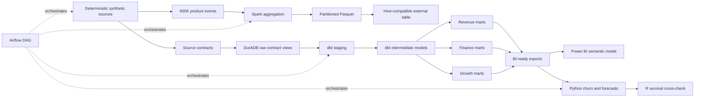

# Subscription Revenue and Customer Growth Intelligence Platform

> A tested analytics platform that explains recurring-revenue movement, identifies billing leakage, prioritizes retention work, and gives Finance and Revenue Operations a reconciled metric layer.

This project models how a B2B SaaS analytics team would connect subscription activity, invoices, payments, product usage, support, marketing, customer health, and revenue recognition into one decision system. It is an analytics product, not a notebook collection.

All data is deterministic and synthetic. Findings describe the project dataset only. No production impact is claimed.

## Executive snapshot

| Verified result | Evidence |
|---|---:|
| Source and modeling records | **695,036** |
| Product-usage events | **600,000** |
| Customer accounts | **1,200** |
| December 2025 MRR | **$2.282M** |
| December 2025 ARR | **$27.387M** |
| Maximum MRR bridge variance | **$0.00** |
| Failed-payment exposure | **$1.400M across 575 attempts** |
| Finance exceptions detected | **963 contract-date conflicts** |
| dbt validation | **36 models, 71 tests, 104/104 resources passed** |
| Churn baseline | **0.996 ROC-AUC, 0.894 PR-AUC** |

## The business story

The fictional company grows MRR steadily through most of the 36-month observation window. In December 2025, $189K of churned MRR overwhelms $45K of new MRR and $27K of expansion, producing negative $124K net new MRR. The movement model reconciles opening MRR to closing MRR with no unexplained variance.


This changes the executive question from “Did revenue decline?” to “Which customer segments, product relationships, and operational failures created the decline, and which teams own the response?”

The finance control layer then separates commercial performance from collection and data-quality problems. It quantifies $1.400M of failed-payment exposure and places 963 contract-date conflicts into an exception queue with invoice-level traceability.


The predictive layer uses time-aware train, calibration, and future-test periods. A calibrated logistic baseline remains competitive with gradient boosting, which preserves interpretability for Customer Success. Rolling forecast backtests also expose an important limitation: total MRR and cash are comparatively stable, while churned MRR is highly intermittent and much harder to forecast.


The high churn-model scores are intentionally disclosed as a synthetic-data artifact. Risk signals were encoded into the generator, so these results validate the modeling and leakage-prevention workflow, not expected production performance.

## Decisions this platform supports

| Stakeholder | Decision enabled | Trusted output |
|---|---|---|
| Executive leadership | Is growth durable, and what changed this month? | MRR bridge, ARR, GRR, NRR, forecast scenarios |
| Finance | Do subscription, invoice, payment, refund, and recognition records reconcile? | Billing reconciliation and exception marts |
| Revenue Operations | Is net new MRR driven by acquisition, expansion, contraction, or churn? | Customer-product-month movement fact |
| Customer Success | Which accounts should enter a constrained retention queue? | Calibrated churn scores and economic threshold |
| Marketing | Which channels create efficient downstream growth? | Channel efficiency mart |
| Product | Is falling adoption associated with elevated risk? | Customer monthly health mart |

## Architecture



### Technology responsibilities

| Technology | Nonduplicative responsibility |
|---|---|
| SQL and dbt | Primary transformation language, metric logic, lineage, documentation, and tests |
| Python | Synthetic generation, contracts, loading, modeling, forecasting, exports, and automation |
| PySpark | High-volume product-event aggregation and partitioned Parquet output |
| DuckDB | Tested local warehouse and reproducible fallback |
| Airflow | Pipeline dependency graph from generation through monitoring |
| R | Independent Kaplan-Meier and Cox proportional-hazards implementation |
| Power BI and DAX | Executive semantic layer and decision-focused report specification |
| GitHub Actions | Automated Python, SQL, and dbt validation |

BigQuery is the intended cloud warehouse path when credentials are available. This repository does not claim an untested cloud deployment.

## Proof of work

This repository contains executable evidence for the critical business logic:

| Capability | Implementation | Verification |
|---|---|---|
| Reproducible synthetic system | [`src/generation/generate.py`](src/generation/generate.py) | Fixed seed, source manifest, generation tests |
| Source contracts | [`src/validation/validate_sources.py`](src/validation/validate_sources.py) | Keys, dates, discounts, MRR, and relationships checked |
| MRR movement classification | [`fct_mrr_movement.sql`](dbt/models/marts/revenue/fct_mrr_movement.sql) | Movement exclusivity, uniqueness, nonnegative balances |
| MRR roll-forward | [`mart_mrr_bridge.sql`](dbt/models/marts/revenue/mart_mrr_bridge.sql) | Maximum difference equals $0.00 |
| Billing reconciliation | [`fct_billing_reconciliation.sql`](dbt/models/marts/finance/fct_billing_reconciliation.sql) | Invoice arithmetic and recognition tests |
| Exception detection | [`mart_finance_exceptions.sql`](dbt/models/marts/finance/mart_finance_exceptions.sql) | Tested types, severities, and non-null invoice keys |
| Failed-payment exposure | [`assert_failed_payment_exposure_quantified.sql`](dbt/tests/assert_failed_payment_exposure_quantified.sql) | Nonzero exposure required when failed attempts exist |
| Leakage-safe churn modeling | [`src/modeling/churn.py`](src/modeling/churn.py) | Time splits, calibration, lift, Brier score, and threshold economics |
| Rolling forecast backtests | [`src/modeling/forecast.py`](src/modeling/forecast.py) | Naive, seasonal-naive, and drift candidates compared |
| Distributed-event path | [`spark/process_usage_events.py`](spark/process_usage_events.py) | Partitioned Parquet design and Hive DDL |
| Orchestration | [`airflow/dags/subscription_intelligence.py`](airflow/dags/subscription_intelligence.py) | Ordered generation-to-monitoring DAG |
| BI semantic design | [`powerbi/semantic_model.md`](powerbi/semantic_model.md) | 39 explicit DAX measures and QA checklist |
| README evidence charts | [`scripts/generate_readme_visuals.py`](scripts/generate_readme_visuals.py) | Regenerated from tested exports and model artifacts |

## Data model

The platform uses a dimensional structure designed for business investigation:

- Customer, account, product, plan, date, channel, geography, sales-rep, and customer-success dimensions
- Subscription, subscription-event, invoice, invoice-line, payment, refund, product-usage, support, marketing-spend, lead, opportunity, contract, health, and recognition facts
- Customer-product-month MRR movements
- Invoice-level billing reconciliation
- Customer-month health and channel-efficiency marts

See the [data dictionary](docs/data_dictionary.md), [metric dictionary](docs/metric_dictionary.md), and [source-to-target map](docs/source_to_target_mapping.md) for grain, ownership, inclusions, exclusions, and known limitations.

## Analytical design

### Revenue movement

For every reporting month:

```text
Closing MRR = Opening MRR
            + New MRR
            + Expansion MRR
            + Reactivation MRR
            - Contraction MRR
            - Churned MRR
```

The bridge is tested at customer, product, plan, and month grain before aggregation.

### Finance reconciliation

The finance layer compares:

- invoice header to invoice lines;
- invoices to successful and failed payment attempts;
- payments to refunds;
- invoice lines to recognized and deferred amounts;
- invoice dates to subscription and contract validity;
- currencies across billing records.

Exceptions are materialized as operational records rather than buried in a QA notebook.

### Churn risk

The modeling contract uses one account snapshot per as-of date and a future 90-day churn label. Identifiers and post-outcome fields are excluded. The final split contains 2,122 training, 1,587 calibration, and 3,057 future-test rows. Threshold selection uses a documented contact-cost and retained-margin framework.

### Forecasts and scenarios

MRR, churned MRR, and cash use rolling-origin backtests. Scenario outputs separately label changes to churn, pricing, expansion, failed-payment recovery, and marketing assumptions, so projected values cannot be mistaken for actuals.

## Power BI decision system

The repository defines an eight-page report:

1. Executive overview
2. MRR and ARR movement
3. Retention and cohorts
4. Customer health and churn risk
5. Sales and marketing efficiency
6. Billing and revenue reconciliation
7. Forecast and scenario planning
8. Data quality and metric trust

The [report design](powerbi/report_design.md), [semantic model](powerbi/semantic_model.md), [DAX library](powerbi/measures.dax), and [QA checklist](powerbi/qa_checklist.md) cover drill-through, date intelligence, dynamic titles, tooltips, accessibility, last refresh, and warehouse tie-outs.

Native `.pbix` authoring and screenshots remain explicitly unverified because Power BI Desktop is unavailable on the macOS build host. No dashboard image is fabricated.

## Reproduce the project

### Prerequisites

- Python 3.9 or newer
- [`uv`](https://docs.astral.sh/uv/)
- Git
- Java 11 or 17 for the optional Spark execution
- R and the `survival` package for the optional independent analysis

### Local pipeline

```bash
uv sync --extra dev
make generate
make validate
make load
make dbt
make analytics
make test
```

### Rebuild the README evidence

```bash
uv run python scripts/generate_readme_visuals.py
```

### Optional Spark path

```bash
uv sync --extra spark --extra dev
make spark
```

### Optional R validation

```bash
Rscript r/survival_analysis.R
```

## Validation status

| Check | Result |
|---|---|
| Python tests | **12 passed** |
| Ruff | **Passed** |
| dbt build | **104/104 resources passed** |
| dbt data tests | **71 passed** |
| MRR bridge | **$0.00 maximum variance** |
| Source contracts | **Passed** |
| Git whitespace and repository hygiene | **Passed** |
| Spark runtime | Blocked by missing Java runtime on the build host |
| R runtime | Blocked by missing R runtime on the build host |
| Native Power BI QA | Requires Power BI Desktop |

## Recommendations from the synthetic evidence

1. Correct contract lifecycle rules behind the 963 date conflicts before relying on renewal and recognition reporting.
2. Operationalize failed-payment recovery for the 575 attempts representing $1.400M of exposure.
3. Pilot a constrained retention queue using the cost-selected logistic threshold, then measure incremental renewal through a controlled experiment.
4. Investigate the December churn cohort by segment, plan, acquisition channel, support burden, and adoption decline.
5. Require executive metrics to pass the dbt reconciliation layer before Power BI refresh.

These recommendations are simulated and have not been implemented by a real company.

## Repository map

```text
├── airflow/            Pipeline orchestration
├── assets/readme/      Verified README visual evidence
├── config/             Reproducible project configuration
├── dbt/                Staging, intermediate, dimensions, facts, marts, tests
├── docs/               Architecture, requirements, dictionaries, methodology
├── hive/               Hive-compatible product-usage table definition
├── powerbi/            Semantic model, DAX, page design, QA checklist
├── r/                  Independent survival-analysis implementation
├── reports/            Executive and technical reports
├── spark/              Distributed product-event processing
├── sql/                Stakeholder-facing analytical queries
├── src/                Generation, ingestion, validation, modeling, analytics
└── tests/              Python analytical and data-generation tests
```

## Known limitations

- The project is synthetic and cannot substantiate causal or production impact.
- Multi-product lifecycle behavior, reactivation movements, and deferred-revenue schedules need further implementation.
- Several catalog metrics remain governed backlog definitions rather than tested marts.
- Churn performance is unusually high because the generator encodes strong predictive signals.
- BigQuery, Spark runtime, R runtime, Airflow scheduler execution, and native Power BI behavior were not validated on this host.

See [limitations and ethics](docs/limitations_and_ethics.md) and the [technical report](reports/technical_report.md) for the complete disclosure.
