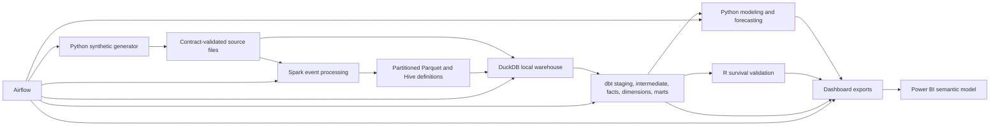

# Architecture and Decision Record

## Logical flow

## Responsibilities

| Technology | Nonduplicative responsibility |
|---|---|
| SQL and dbt | Canonical business transformations, dimensional models, metric logic, tests, docs, and lineage |
| Python | Synthetic generation, contracts, ingestion, forecasting, machine learning, automation, and reproducible analysis |
| Spark SQL / PySpark | Distributed processing of the largest product-event table and benchmarked aggregation |
| Parquet and Hive DDL | Partitioned event storage and portable external-table definitions |
| DuckDB | Zero-credential local warehouse and reference execution target |
| BigQuery | Optional primary cloud warehouse when credentials are available |
| Airflow | Dependency-aware orchestration, retries, observability, and scheduled reproducibility |
| R | Independent survival or cohort inference and cross-check of key conclusions |
| Power BI | Executive and operational decision interface with governed DAX and drill-through |
| Excel | Optional finance reconciliation review pack only, not a second BI layer |

## Modeling conventions

- Surrogate keys isolate analytics models from mutable source identifiers.
- Facts retain transaction or event grain; aggregate marts never replace audit-level facts.
- `dim_date` is the canonical calendar and fiscal date source.
- Monetary facts retain transaction currency, exchange rate, and reporting-currency amount where applicable.
- Monthly MRR movement is derived from customer-product-plan snapshots and explicit prior-period comparison.
- Actual, forecast, and scenario records carry a scenario-type field and must not be summed without it.
- Model feature tables use an as-of timestamp and only observations available by that timestamp.

## Incremental strategy

Incremental models are appropriate for immutable or append-heavy events, invoice lines, payments, usage aggregates, and feature snapshots. Dimensions and small reconciliation tables may remain full refreshes. Any incremental model must support deterministic reprocessing by partition and prove equivalence to a full refresh on a bounded test fixture.

## Environments and boundaries

The local path is the acceptance baseline. BigQuery support is conditional because cloud credentials and billing authority are outside project scope. Power BI Desktop authoring and visual screenshots are conditional on the application being available. No production deployment is implied.
